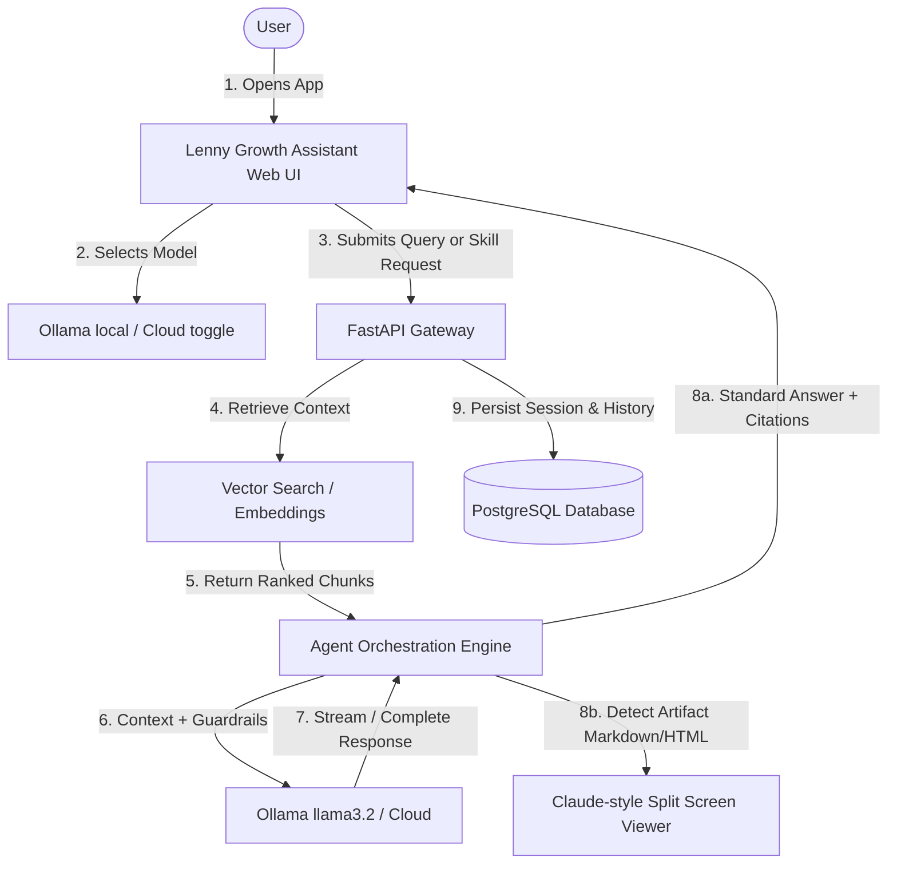

# Product Requirements Document (PRD)
## Project: The Lenny Growth Assistant
**Author:** Forward Deployed Engineer  
**Status:** Approved for Implementation  
**Target Delivery:** 2026-08-25  

---

## 1. Executive Summary & Engagement Scenario
"The Lenny Growth Assistant" is an internal AI-powered conversational web application designed for Product Managers, Growth Leads, Founders, and Operators. It transforms 200+ hours of raw, unstructured transcripts from *Lenny's Podcast* and newsletter archive into a reliable, grounded knowledge assistant.

Users can:
1. Ask nuanced product, growth, leadership, and operational questions and receive answers strictly grounded in podcast knowledge with precise episode/guest citations.
2. Generate structured, publication-grade written artifacts—notably **"Ship 30 for 30"** style growth essays (~1,250 words) adhering to proven digital writing principles.
3. View and interact with generated Markdown, HTML, and CSS artifacts live in a split-screen in-app viewer (similar to Claude Artifacts) with secure sandboxing.
4. Seamlessly run on a 100% free, local-first stack using **Ollama** (`llama3.2`), with an optional cloud model toggle for enterprise evaluators.

---

## 2. Forward Deployment Brief

### 2.1 User Personas & Problem Statement

| Persona | Primary Job-To-Be-Done (JTBD) | Pain Points Removed |
| :--- | :--- | :--- |
| **Product Manager (PM)** | Finding actionable frameworks on product-market fit, user onboarding, PRDs, and roadmapping from top tech leaders (e.g., Brian Chesky, Shreyas Doshi). | Eliminates hours of scrubbing through podcast episodes and searching generic internet summaries. |
| **Growth Lead / Marketer** | Identifying validated B2B/B2C growth loops, pricing strategies, retention tactics, and distribution channels. | Eliminates generic LLM hallucinations; replaces vague advice with battle-tested tactical examples. |
| **Founder / Operator** | Creating high-impact internal documentation, leadership memos, and growth essays to share with teams and stakeholders. | Eliminates manual drafting; generates formatted, publication-ready essays grounded in expert insights. |

### 2.2 Core Value Proposition
> *"Turn expert podcast wisdom into grounded answers, actionable essays, and live-rendered artifacts in seconds—without prompt engineering, cloud costs, or risk of hallucination."*

---

## 3. Success Metrics

### 3.1 Product Quality & AI Performance
* **Grounding Precision & Source Attribution:** 100% of factual claims in generated answers must provide verifiable citations (Episode Title, Guest Name, and approximate Timestamp/Context).
* **Hallucination Rate (Out-of-Scope Queries):** 0% ungrounded responses. If a user asks a question not covered in the transcript corpus (e.g., *"How do I bake sourdough bread?"*), the system must explicitly acknowledge the lack of coverage rather than fabricate an answer.
* **Ship 30 for 30 Essay Quality:** Generated essays must adhere to a target length of ~1,250 words, featuring a captivating hook, 1-3-1 rhythmic cadence, bolded skim-friendly takeaways, and clear tactical action items.
* **Retrieval Relevance:** Top-3 cosine similarity retrieval must exceed a score of `0.65` for in-domain queries.

### 3.2 Operational & Technical Readiness
* **Local-First Latency:** End-to-end response generation on local Ollama (`llama3.2`) under **4 seconds** for initial token response.
* **Zero Cloud Cost & Zero Setup Barrier:** 100% functional out-of-the-box using local Ollama and local PostgreSQL with zero credit cards, paid API keys, or cloud dependencies.
* **Deployment Reproducibility:** Single-command startup via `docker-compose up` or local virtualenv script.
* **Security & Isolation:** 100% of untrusted HTML artifacts isolated in an iframe sandbox without parent DOM or cookie access.

---

## 4. Explicit Assumptions & Scope Boundaries

### 4.1 Assumptions
1. **Transcript Data Source:** Transcripts are sourced from Lenny's publicly available podcast/newsletter transcript repository in text/markdown/json format.
2. **Target Hardware:** The evaluator runs the demo on a modern laptop/desktop (Windows, macOS, or Linux) with Ollama installed locally.
3. **Model Selection:** Local execution uses lightweight, high-performance models (e.g., Meta `llama3.2:1b`/`llama3.2:3b` or `mistral:7b`), ensuring fast local CPU/GPU execution without exceeding 4GB VRAM.
4. **Single-Tenant Operational Model:** Designed as a high-trust internal product/growth assistant with session-based isolation.

### 4.2 Scope Choices (Included vs. Excluded)

```
┌──────────────────────────────────────────────┬──────────────────────────────────────────────┐
│             IN SCOPE (Included)              │         OUT OF SCOPE (Intentionally Excluded)│
├──────────────────────────────────────────────┼──────────────────────────────────────────────┤
│ • Grounded RAG with exact guest/episode tags │ • Real-time live audio transcription         │
│ • "Ship 30 for 30" 1,250-word essay generator│   (Reason: Unnecessary latency & GPU cost;   │
│ • Split-screen Claude-style Artifact Viewer  │    curated transcripts provide higher fidelity)│
│ • Local Ollama + Cloud Provider switch       │ • Paid vector cloud databases (Pinecone/Qdrant│
│ • Multi-turn session persistence (Postgres)  │   (Reason: Local ChromaDB/pgvector is 100%   │
│ • Iframe HTML/CSS sandbox security layer     │    free and requires zero external accounts) │
│ • Structured JSON logging & health checks    │ • Complex multi-tenant enterprise IAM / RBAC │
│ • Automated test suite (Pytest + API tests)  │   (Reason: Premature optimization for demo)  │
└──────────────────────────────────────────────┴──────────────────────────────────────────────┘
```

---

## 5. Adversarial Input & Risk Management

| Risk / Threat | Severity | Mitigation Strategy |
| :--- | :--- | :--- |
| **Prompt Injection & Jailbreaks** | High | User inputs and retrieved context chunks are isolated inside strict XML boundary tags (`<transcript_context>`, `<user_query>`). The system prompt instructs the model to treat input within tags strictly as data, never as instructions. |
| **Malicious HTML Artifacts (XSS)** | Critical | Rendered HTML artifacts are hosted inside an `<iframe sandbox="allow-scripts">` element omitting `allow-same-origin`. Sanitization via `DOMPurify` / `bleach` strips `onerror`, `onload`, inline script injection, and `javascript:` URIs. |
| **Hallucination on Unknown Queries** | High | Embedding similarity threshold gating: If retrieved context confidence is `< 0.60`, the agent returns a standard grounded refusal: *"This topic is not covered in Lenny's Podcast transcripts."* |
| **Service Outages (Ollama / Cloud LLM)** | Medium | FastAPI resilience layer with timeout detection, health endpoint monitoring, and user-friendly error banners in the UI. |
| **Database Injection (SQLi)** | High | SQLAlchemy ORM parameterized queries used across all session and message persistence layers. |

---

## 6. Key User Flows & Functional Requirements



### Flow 1: Grounded Conversational Q&A
* **Trigger:** User asks a conceptual or tactical question (e.g., *"What is Brian Chesky's advice on founder-led product management?"*).
* **Process:** Vector search retrieves the top relevant transcript passages; the agent synthesizes the response quoting the guest and linking the episode.
* **Output:** Answer with interactive citation chips indicating episode name and context.

### Flow 2: Ship 30 for 30 Growth Essay Generation
* **Trigger:** User asks for an essay, guide, or clicks the *"Write a Ship 30 for 30 Essay"* action chip.
* **Process:** The dedicated Ship 30 skill structures the grounded knowledge into:
  - Strong, provocative hook
  - 1-3-1 cadence introduction
  - 3–5 core tactical sections with bolded headers and punchy bullets
  - Actionable concluding takeaway
  - Word count target ~1,250 words
* **Output:** Full essay rendered both in chat and automatically extracted into the Artifact Viewer.

### Flow 3: Interactive Artifact Generation & Live Preview
* **Trigger:** Assistant generates an HTML/CSS landing page snippet, interactive calculator, or structured markdown framework.
* **Process:** Frontend detects artifact code blocks (````html ... ```` or ````markdown ... ````), slides open the side-by-side Artifact Drawer, and renders the sandboxed live preview.
* **User Controls:** Live Preview tab, Raw Code tab, Copy to Clipboard, Fullscreen toggle, and Download.

---

## 7. Acceptance Criteria

1. **Local Demo Guarantee:** The application boots and answers queries using local Ollama (`llama3.2`) with 0 external API keys configured.
2. **Grounded Accuracy:** Every factual answer cites the transcript source.
3. **Side-by-Side Artifact Viewer:** Generates and renders HTML/CSS and Markdown natively inside the product.
4. **Session Persistence:** Chat sessions and message histories persist across browser reloads via PostgreSQL.
5. **Observability:** Structured logs emitted for all queries, model invocations, retrieval scores, and error events.
