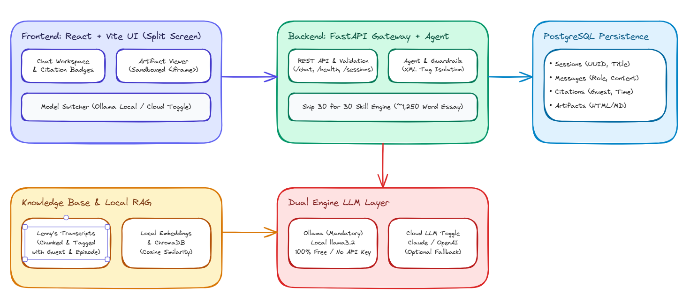
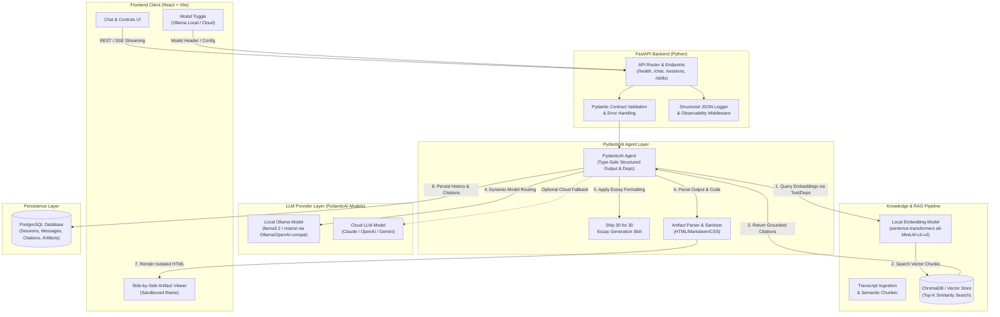

# Architecture & Engineering Specification

---

## 1. System Architecture Overview

The Lenny Growth Assistant is engineered as a modular, local-first RAG application using **PydanticAI** for type-safe agent orchestration, dual LLM engine support (Ollama + optional Cloud), PostgreSQL persistence, and a sandboxed artifact viewer.





---

## 2. Component Boundaries & Responsibilities

| Component | Responsibility | Technologies |
| :--- | :--- | :--- |
| **Frontend Web App** | Modern conversational interface, session switcher, interactive citation pills, and Claude-style split-screen Artifact Viewer. | React 18 / Vite, Vanilla CSS design system, Lucide icons. |
| **API Gateway** | REST contracts, request validation, CORS, health checks, structured error propagation, streaming support. | FastAPI, Uvicorn, Pydantic v2. |
| **Knowledge & RAG Engine** | Ingestion of Lenny transcripts, semantic chunking (500 tokens / 100 token overlap), embedding generation, top-k vector retrieval, and relevance scoring. | `sentence-transformers/all-MiniLM-L6-v2`, `chromadb` / local vector index. |
| **Agent Orchestrator** | Type-safe agent with dependency injection (`RunContext`), structured outputs (`result_type`), dynamic system prompts, XML guardrails, and citation enforcement. | **PydanticAI** (`pydantic-ai`). |
| **Ship 30 for 30 Skill** | Specialized transformer that structures grounded insights into a 1,250-word digital essay with proven hooks, bolding, 1-3-1 cadence, and actionable summaries. | PydanticAI Skill & Structured Output Schema. |
| **LLM Provider Abstraction** | Seamless switching between local Ollama (`llama3.2`) and Cloud providers (Anthropic/OpenAI) using PydanticAI model providers. | PydanticAI `Model` abstractions (`OllamaModel`, `AnthropicModel`, `OpenAIChatModel`). |
| **Persistence Layer** | Relational storage for sessions, messages, citations, and generated artifacts with ACID guarantees. | PostgreSQL 15, SQLAlchemy 2.0 ORM, Alembic migrations. |
| **Security Sandbox** | HTML sanitization and iframe attribute isolation (`sandbox="allow-scripts"`). | DOMPurify / Bleach, isolated iframe. |

---

## 3. Database Schema (PostgreSQL / SQLAlchemy)

```
┌─────────────────────────────────┐       ┌──────────────────────────────────────┐
│           sessions              │       │               messages               │
├─────────────────────────────────┤       ├──────────────────────────────────────┤
│ id: UUID (PK)                   │◄──┐   │ id: UUID (PK)                        │
│ title: VARCHAR(255)             │   │   │ session_id: UUID (FK -> sessions.id) │
│ created_at: TIMESTAMPTZ         │   └───┼─created_at: TIMESTAMPTZ              │
│ updated_at: TIMESTAMPTZ         │       │ role: VARCHAR(32) [user|assistant]   │
│ metadata_json: JSONB            │       │ content: TEXT                        │
└─────────────────────────────────┘       │ model_used: VARCHAR(64)              │
                                          └──────────────────┬───────────────────┘
                                                             │
                                          ┌──────────────────┴───────────────────┐
                                          ▼                                      ▼
┌──────────────────────────────────────────────┐       ┌──────────────────────────────────────────────┐
│                  citations                   │       │                  artifacts                   │
├──────────────────────────────────────────────┤       ├──────────────────────────────────────────────┤
│ id: UUID (PK)                                │       │ id: UUID (PK)                                │
│ message_id: UUID (FK -> messages.id)         │       │ message_id: UUID (FK -> messages.id)         │
│ episode_title: VARCHAR(255)                  │       │ session_id: UUID (FK -> sessions.id)         │
│ guest: VARCHAR(128)                          │       │ artifact_type: VARCHAR(32) [markdown|html]   │
│ timestamp_str: VARCHAR(32)                   │       │ title: VARCHAR(255)                          │
│ snippet: TEXT                                │       │ content: TEXT                                │
│ source_url: VARCHAR(512)                     │       │ version: INTEGER                             │
│ similarity_score: FLOAT                      │       │ created_at: TIMESTAMPTZ                      │
└──────────────────────────────────────────────┘       └──────────────────────────────────────────────┘
```

---

## 4. API Endpoints Contract

### 4.1 Health & Diagnostics
* `GET /health`
  - **Response 200 OK:**
    ```json
    {
      "status": "healthy",
      "timestamp": "2026-08-25T10:50:00Z",
      "components": {
        "database": "connected",
        "vector_store": "ready (1,842 chunks indexed)",
        "ollama_local": "available (model: llama3.2)",
        "cloud_llm": "configured (provider: anthropic)"
      }
    }
    ```

### 4.2 Session Management
* `POST /api/sessions` — Create a new conversation session.
* `GET /api/sessions` — List all active and recent sessions.
* `GET /api/sessions/{session_id}` — Get session history with all messages, citations, and artifacts.
* `DELETE /api/sessions/{session_id}` — Delete a session.

### 4.3 Conversational RAG & Skill Chat
* `POST /api/chat`
  - **Request Body:**
    ```json
    {
      "session_id": "3fa85f64-5717-4562-b3fc-2c963f66afa6",
      "message": "How does Brian Chesky approach product reviews?",
      "model_override": "ollama/llama3.2",
      "skill": "default" 
    }
    ```
  - **Response 200 OK:**
    ```json
    {
      "message_id": "b1b2c3d4-...",
      "role": "assistant",
      "content": "Brian Chesky advocates for a founder-led product review cadence...",
      "model_used": "ollama/llama3.2",
      "citations": [
        {
          "episode_title": "Leading Airbnb through hypergrowth",
          "guest": "Brian Chesky",
          "timestamp_str": "00:14:22",
          "snippet": "I personally review every major product change weekly...",
          "similarity_score": 0.88
        }
      ],
      "artifact": null
    }
    ```

### 4.4 Ship 30 for 30 Dedicated Skill
* `POST /api/skills/ship30`
  - **Request Body:**
    ```json
    {
      "session_id": "3fa85f64-5717-4562-b3fc-2c963f66afa6",
      "topic": "The 3 Non-Obvious Laws of Product-Led Growth",
      "guest_focus": "Elena Verna",
      "target_word_count": 1250
    }
    ```
  - **Response 200 OK:**
    ```json
    {
      "message_id": "c2d3e4f5-...",
      "content": "Here is the 1,250-word Ship 30 for 30 essay grounded in Elena Verna's episodes...",
      "artifact": {
        "id": "art-9910",
        "title": "The 3 Non-Obvious Laws of PLG (Ship 30 for 30 Essay)",
        "artifact_type": "markdown",
        "content": "# The 3 Non-Obvious Laws of PLG\n\nMost founders think PLG is a pricing model..."
      },
      "citations": [...]
    }
    ```

---

## 5. Ingestion, Chunking & Retrieval Flow

1. **Source Loading:** Reads markdown and text transcript files from `data/transcripts/`.
2. **Metadata Extraction:** Extracts Episode Title, Guest Name, Date, YouTube/Audio URL, and transcript speaker blocks.
3. **Semantic Chunking:**
   - Window size: ~500 tokens.
   - Overlap: ~100 tokens.
   - Preserves speaker turn boundaries to prevent context fragmentation.
4. **Vector Embedding:** Embeds chunks using `sentence-transformers/all-MiniLM-L6-v2` (384-dimensional vector, fast local CPU inference, zero cost).
5. **Similarity Search & Reranking:**
   - Cosine similarity matching against query vector.
   - Relevance threshold cutoff: `score >= 0.60`.
   - Top-3 chunks injected into `<transcript_context>` XML prompt section.

---

## 6. Threat Mitigation & Security Topology

```mermaid
flowchart LR
    UserInput["Untrusted User Input"] -->|Step 1: Pydantic Validation| InputGuard["Length & Syntax Guard"]
    InputGuard -->|Step 2: XML Delimitation| PromptEngine["Prompt Assembly\n<user_query>\n<transcript_context>"]
    PromptEngine -->|Step 3: Guardrailed Inference| LLM["Ollama / Cloud LLM"]
    LLM -->|Step 4: Extract Code & HTML| Sanitizer["DOMPurify / Bleach Sanitizer"]
    Sanitizer -->|Step 5: Sandboxed Render| Frame["<iframe sandbox='allow-scripts'>\n(No parent DOM / cookie access)"]
```



1. **Prompt Injection Defense:** Strict XML tags enclose query and context. Instructions explicitly state that data inside XML tags must never be interpreted as system commands.
2. **XSS Defense:** Generated HTML is sanitized and rendered inside an isolated iframe with `allow-same-origin` strictly omitted.
3. **SQL Injection Defense:** All queries executed via SQLAlchemy ORM parameterized bind parameters.
4. **Resource Exhaustion Defense:** FastAPI request rate limits, payload size constraints (max 4KB per query), and LLM request timeouts (30s).

---

## 7. Deployment & Operational Topology

```
┌─────────────────────────────────────────────────────────────┐
│                    Docker Compose Network                   │
│                                                             │
│  ┌──────────────────┐   HTTP (8000)   ┌──────────────────┐  │
│  │   frontend-app   │◄───────────────►│   fastapi-api    │  │
│  │   (Vite / Nginx) │                 │   (Uvicorn)      │  │
│  │   Port: 3000     │                 │   Port: 8000     │  │
│  └──────────────────┘                 └────────┬─────────┘  │
│                                                │            │
│                       ┌────────────────────────┴────────┐   │
│                       ▼                                 ▼   │
│              ┌──────────────────┐             ┌────────────┐│
│              │    postgres-db   │             │ Vector     ││
│              │    PostgreSQL 15 │             │ ChromaDB   ││
│              │    Port: 5432    │             │ Local Vol  ││
│              └──────────────────┘             └────────────┘│
└─────────────────────────────────────────────────────────────┘
                               ▲
                        HTTP (11434)
                               ▼
        ┌──────────────────────────────────────────────┐
        │       Local Host Ollama Engine (11434)       │
        │       (llama3.2 / mistral / qwen2.5)         │
        └──────────────────────────────────────────────┘
```
